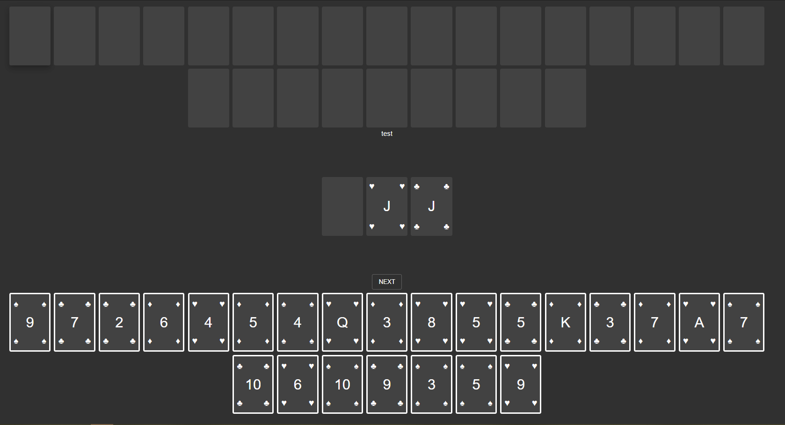

# Material Card Game Engine


## Overview

Material Card Game Engine (MCGE) is an open-source multiplayer card game engine. MCGE is built using [NextJS](nextjs.org) and Socket.IO following [Material Design](https://material.io/design/) principles. 



## Getting Started

You can start the server using the following NodeJS command:

```
npm run dev
```

The server will be hosted at http://localhost.

## Creating A Game

You'll want to create a class that extends `/express_api/components/Game`. You can refer to the example games in `/games`. In addition, create a `theme.json` to define the theme of the cards (an empty file results in the default theme).